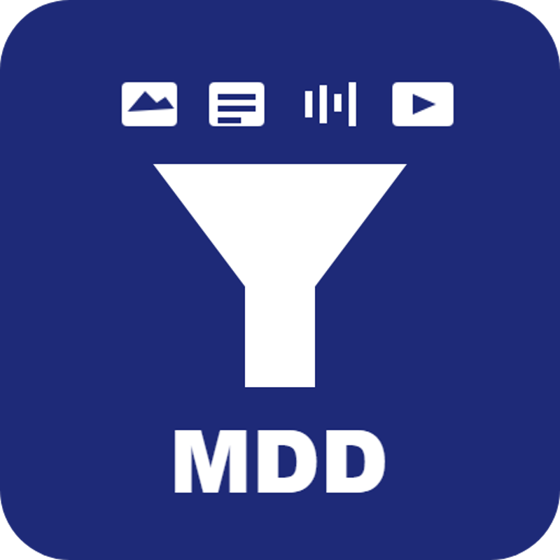

# Awesome Multimodal Dataset Distillation

<div align="center">
  
  <div>&nbsp;</div>
  <div align="center">
    <b><font size="3">Vision-Language</font></b>
    &nbsp;&nbsp;
    ·
    &nbsp;&nbsp;&nbsp;
    <b><font size="3">Audio-Visual</font></b>
  </div>
  <div>&nbsp;</div>
</div>

Awesome Multimodal Dataset Distillation provides the most comprehensive and detailed information on the Multimodal Dataset Distillation field.

Multimodal dataset distillation is the task of synthesizing a small multimodal dataset such that models trained on it achieve high performance on the original large dataset. A multimodal dataset distillation algorithm takes as input a large real multimodal dataset to be distilled (training set), and outputs a small synthetic distilled dataset, which is evaluated via testing models trained on this distilled dataset on a separate real dataset (validation/test set). A good small distilled multimodal dataset is not only useful in dataset understanding, but has various applications (e.g., continual learning, privacy, neural architecture search, etc.). This task extends the concept of dataset distillation to multiple modalities, allowing for more comprehensive and efficient learning across different types of data.

In recent years, multimodal dataset distillation has gained increasing attention in the research community, across many institutes and labs. More papers are now being published each year. These wonderful researches have been constantly improving multimodal dataset distillation and exploring its various variants and applications.

This project is curated and maintained by [andyj1](https://github.com/andyj1).

<!-- ## How to submit a pull request? -->
<!-- 🌐 [Project Page](#)
📦 [Code](#)
📖 [bibtex](#) -->

<!-- ## Latest Updates

[YYYY/MM/DD] Paper Title 1 (Author Names, Conference YYYY) [🌐](#) [📖](#)
[YYYY/MM/DD] Paper Title 2 (Author Names, Conference YYYY) [📖](#)
[YYYY/MM/DD] Paper Title 3 (Author Names et al., YYYY) [🌐](#) [📖](#)
[YYYY/MM/DD] Paper Title 4 (Author Names et al., Conference YYYY) [📖](#)
[YYYY/MM/DD] Paper Title 5 (Author Names et al., Conference YYYY) [🌐](#) [📖](#) -->

## Contents

Papers are grouped by the modalities they operate on. **Multimodal** sections cover true modality *combinations* (the focus of this list); **single-modality** sections collect the foundational and adjacent works that the multimodal methods build on.

- [Surveys](#surveys)
- [Multimodal: Vision-Language](#multimodal-vision-language)
- [Multimodal: Audio-Visual](#multimodal-audio-visual)
- [Single-Modality: Vision (Image-only)](#single-modality-vision-image-only)
- [Single-Modality: Text](#single-modality-text)
- [Single-Modality: Speech & Audio](#single-modality-speech--audio)
- [Related Resources](#related-resources)

<!-- ### Applications

- [Continual Learning](#continual-learning)
- [Privacy](#privacy)
- [Medical](#medical)
- [Federated Learning](#federated-learning)
- [Robotics](#robotics)
- [Autonomous Driving](#autonomous-driving)
- [Recommendation Systems](#recommendation-systems)
- [Robustness](#robustness)
- [Fairness](#fairness) -->

## Papers

> Link legend: 📖 paper · [Project Page 🌐] author/project website · [GitHub 🌐] code repository.

### Surveys

- [A Comprehensive Survey to Dataset Distillation 📖](https://arxiv.org/abs/2301.05603) (Lei & Tao, arXiv 2023)

- [Data Distillation: A Survey 📖](https://openreview.net/forum?id=6Da7Z6uE8v) (Sachdeva & McAuley, TMLR 2023)

- [A Survey on Dataset Distillation: Approaches, Applications and Future Directions 📖](https://www.ijcai.org/proceedings/2023/741) (Geng et al., IJCAI 2023)

- [Dataset Distillation: A Comprehensive Review 📖](https://doi.org/10.1109/TPAMI.2023.3323376) (Yu et al., TPAMI 2024)

- [The Evolution of Dataset Distillation: Toward Scalable and Generalizable Solutions 📖](https://arxiv.org/abs/2502.05673) (Liu & Du, arXiv 2025)

### Multimodal: Vision-Language

- [Scaling up Dataset Distillation to ImageNet-1K with Constant Memory 📖](https://proceedings.mlr.press/v202/cui23e/cui23e.pdf) TESLA (Cui et al., ICML 2023) [GitHub 🌐](https://github.com/justincui03/tesla)

- [Vision-Language Dataset Distillation 📖](https://arxiv.org/abs/2308.07545) VL-Distill (Xindi Wu et al., TMLR 2024) [Project Page 🌐](https://princetonvisualai.github.io/multimodal_dataset_distillation/) [GitHub 🌐](https://github.com/princetonvisualai/multimodal_dataset_distillation)

- [Low-Rank Similarity Mining for Multimodal Dataset Distillation 📖](https://arxiv.org/abs/2406.03793) LoRS (Yue Xu et al., ICML 2024) [GitHub 🌐](https://github.com/silicx/LoRS_Distill)

- [Beyond Modality Collapse: Representations Blending for Multimodal Dataset Distillation 📖](https://arxiv.org/abs/2505.14705) RepBlend (Xin Zhang et al., NeurIPS 2025) [GitHub 🌐](https://github.com/zhangxin-xd/RepBlend)

- [Efficient Multimodal Dataset Distillation via Generative Models 📖](https://arxiv.org/abs/2509.15472) EDGE (Zhenghao Zhao et al., NeurIPS 2025) [GitHub 🌐](https://github.com/ichbill/EDGE)

- [CovMatch: Cross-Covariance Guided Multimodal Dataset Distillation with Trainable Text Encoder 📖](https://openreview.net/forum?id=2dpiR9fqUk) CovMatch (Lee & Chung, NeurIPS 2025) [GitHub 🌐](https://github.com/Yongalls/CovMatch)

- [Multi-Modal Dataset Distillation in the Wild 📖](https://arxiv.org/abs/2506.01586) MDW (Dang et al., arXiv 2025)

- [ImagebindDC: Compressing Multi-modal Data with Imagebind-based Condensation 📖](https://arxiv.org/abs/2511.08263) ImagebindDC (Min et al., AAAI 2026)

- [Multimodal Distribution Matching for Vision-Language Dataset Distillation 📖](https://arxiv.org/abs/2605.23482) MDM (Jeong et al., CVPR 2026)

- [Multimodal Dataset Distillation Made Simple by Prototype-Guided Data Synthesis 📖](https://openreview.net/pdf/2d64e6404555760e7b759d1c5038892464071db8.pdf) PDS (Choi et al., ICLR 2026) [GitHub 🌐](https://github.com/junhyeok9712/PDS)

- [Multimodal Dataset Distillation via Phased Teacher Models 📖](https://openreview.net/pdf?id=Me4AON8160) PTM-ST (Guo & Zhao et al., ICLR 2026) [GitHub 🌐](https://github.com/Previsior/PTM-ST)

- [Efficient Multi-modal Dataset Distillation via Analytic Parameter Matching 📖](https://openreview.net/forum?id=Fxz0aaGSNY) APM (ICLR 2026 reject)

- [Asynchronous Matching with Dynamic Sampling for Multimodal Dataset Distillation 📖](https://openreview.net/forum?id=7SgSMKM2KF) AMD (Qi et al., ICLR 2026)
  
- [Rank-Aware Hyperbolic Alignment for Vision-Language Dataset Distillation 📖]([https://arxiv.org/abs/2605.23482](https://arxiv.org/abs/2606.29464)) RAHA (Jeong et al., ECCV 2026)


### Multimodal: Audio-Visual

- [Audio-Visual Dataset Distillation 📖](https://openreview.net/forum?id=IJlbuSrXmk) AVDD (Saksham Singh Kushwaha et al., TMLR 2024) [GitHub 🌐](https://github.com/sakshamsingh1/AVDD)

- [Decoupled Audio-Visual Dataset Distillation 📖](https://arxiv.org/abs/2511.17890) DAVDD (Wenyuan Li & Guang Li et al., arXiv 2025)

---


### Single-Modality: Vision (Image-only)

For the full, dedicated list of image-only methods (327+ papers, kept up to date), see [Awesome Dataset Distillation](https://github.com/Guang000/Awesome-Dataset-Distillation) [🌐] by Guang Li, Bo Zhao, and Tongzhou Wang. The curated selection below covers the seminal, top-tier works that anchor each major image distillation paradigm and are commonly used as baselines by the multimodal methods above; it is organized to mirror that list's method-based taxonomy.

#### Foundational

- [Dataset Distillation 📖](https://arxiv.org/abs/1811.10959) (Wang et al., 2018) [Project Page 🌐](https://ssnl.github.io/dataset_distillation/) [GitHub 🌐](https://github.com/SsnL/dataset-distillation)

#### Gradient & Trajectory Matching

- [Dataset Condensation with Gradient Matching 📖](https://arxiv.org/abs/2006.05929) DC (Zhao et al., ICLR 2021) [GitHub 🌐](https://github.com/VICO-UoE/DatasetCondensation)

- [Dataset Condensation with Differentiable Siamese Augmentation 📖](https://arxiv.org/abs/2102.08259) DSA (Zhao et al., ICML 2021) [GitHub 🌐](https://github.com/VICO-UoE/DatasetCondensation)

- [Dataset Distillation by Matching Training Trajectories 📖](https://arxiv.org/abs/2203.11932) MTT (Cazenavette et al., CVPR 2022) [Project Page 🌐](https://georgecazenavette.github.io/mtt-distillation/) [GitHub 🌐](https://github.com/georgecazenavette/mtt-distillation)

- [Minimizing the Accumulated Trajectory Error to Improve Dataset Distillation 📖](https://arxiv.org/abs/2211.11004) FTD (Du & Jiang et al., CVPR 2023) [GitHub 🌐](https://github.com/AngusDujw/FTD-distillation)

- [Towards Lossless Dataset Distillation via Difficulty-Aligned Trajectory Matching 📖](https://arxiv.org/abs/2310.05773) DATM (Guo & Wang et al., ICLR 2024) [Project Page 🌐](https://gzyaftermath.github.io/DATM/) [GitHub 🌐](https://github.com/GzyAftermath/DATM)

#### Distribution & Feature & Influence Matching

- [CAFE: Learning to Condense Dataset by Aligning Features 📖](https://arxiv.org/abs/2203.01531) CAFE (Wang & Zhao et al., CVPR 2022) [GitHub 🌐](https://github.com/kaiwang960112/cafe)

- [Dataset Condensation with Distribution Matching 📖](https://arxiv.org/abs/2110.04181) DM (Zhao & Bilen, WACV 2023) [GitHub 🌐](https://github.com/VICO-UoE/DatasetCondensation)

- [Improved Distribution Matching for Dataset Condensation 📖](https://arxiv.org/abs/2307.09742) IDM (Zhao et al., CVPR 2023) [GitHub 🌐](https://github.com/uitrbn/IDM)

- [DataDAM: Efficient Dataset Distillation with Attention Matching 📖](https://arxiv.org/abs/2310.00093) DataDAM (Sajedi & Khaki et al., ICCV 2023) [Project Page 🌐](https://datadistillation.github.io/DataDAM/) [GitHub 🌐](https://github.com/DataDistillation/DataDAM)

- [Dataset Distillation with Neural Characteristic Function: A Minmax Perspective 📖](https://arxiv.org/abs/2502.20653) NCFM (Wang et al., CVPR 2025) [GitHub 🌐](https://github.com/gszfwsb/NCFM)

- [Geometry-Aware Dataset Condensation for Diffusion Model Training 📖](https://arxiv.org/abs/2512.08317) GeoDM (Xiao Cui et al., ICML 2026)

- [Dataset Distillation by Influence Matching  📖](https://openaccess.thecvf.com/content/CVPR2026/html/Tan_Dataset_Distillation_by_Influence_Matching_CVPR_2026_paper.html) Inf-Match (Tan et al., CVPR 2026)

#### Kernel-Based

- [Dataset Meta-Learning from Kernel Ridge-Regression 📖](https://arxiv.org/abs/2011.00050) KIP (Nguyen et al., ICLR 2021) [GitHub 🌐](https://github.com/google/neural-tangents)

- [Dataset Distillation using Neural Feature Regression 📖](https://arxiv.org/abs/2206.00719) FRePo (Zhou et al., NeurIPS 2022) [Project Page 🌐](https://sites.google.com/view/frepo) [GitHub 🌐](https://github.com/yongchao97/FRePo)

- [Dataset Distillation with Convexified Implicit Gradients 📖](https://arxiv.org/abs/2302.06755) RCIG (Loo et al., ICML 2023) [GitHub 🌐](https://github.com/yolky/RCIG)

#### Distilled Dataset Parametrization

- [Dataset Condensation via Efficient Synthetic-Data Parameterization 📖](https://arxiv.org/abs/2205.14959) IDC (Kim et al., ICML 2022) [GitHub 🌐](https://github.com/snu-mllab/efficient-dataset-condensation)

- [Dataset Distillation via Factorization 📖](https://arxiv.org/abs/2210.16774) HaBa (Liu et al., NeurIPS 2022) [GitHub 🌐](https://github.com/Huage001/DatasetFactorization)

- [Slimmable Dataset Condensation 📖](https://openaccess.thecvf.com/content/CVPR2023/html/Liu_Slimmable_Dataset_Condensation_CVPR_2023_paper.html) (Liu et al., CVPR 2023)

- [Distilling Dataset into Neural Field 📖](https://arxiv.org/abs/2503.04835) DDiF (Shin et al., ICLR 2025) [GitHub 🌐](https://github.com/aailab-kaist/DDiF)

#### Generative

- [Generalizing Dataset Distillation via Deep Generative Prior 📖](https://arxiv.org/abs/2305.01649) GLAD (Cazenavette et al., CVPR 2023) [Project Page 🌐](https://georgecazenavette.github.io/glad/) [GitHub 🌐](https://github.com/georgecazenavette/glad)

- [Efficient Dataset Distillation via Minimax Diffusion 📖](https://arxiv.org/abs/2311.15529) (Gu et al., CVPR 2024) [GitHub 🌐](https://github.com/vimar-gu/MinimaxDiffusion)

- [D4M: Dataset Distillation via Disentangled Diffusion Model 📖](https://arxiv.org/abs/2407.15138) D4M (Su & Hou et al., CVPR 2024) [Project Page 🌐](https://junjie31.github.io/D4M/) [GitHub 🌐](https://github.com/suduo94/D4M)

#### Decoupled Distillation

- [Squeeze, Recover and Relabel: Dataset Condensation at ImageNet Scale From A New Perspective 📖](https://arxiv.org/abs/2306.13092) SRe2L (Yin & Shen et al., NeurIPS 2023) [Project Page 🌐](https://zeyuanyin.github.io/projects/SRe2L/) [GitHub 🌐](https://github.com/VILA-Lab/SRe2L/tree/main/SRe2L)

- [Generalized Large-Scale Data Condensation via Various Backbone and Statistical Matching 📖](https://arxiv.org/abs/2311.17950) G-VBSM (Shao et al., CVPR 2024) [GitHub 🌐](https://github.com/shaoshitong/G_VBSM_Dataset_Condensation)

- [On the Diversity and Realism of Distilled Dataset: An Efficient Dataset Distillation Paradigm 📖](https://arxiv.org/abs/2312.03526) RDED (Sun et al., CVPR 2024) [GitHub 🌐](https://github.com/LINs-lab/RDED)

- [Elucidating the Design Space of Dataset Condensation 📖](https://arxiv.org/abs/2404.13733) EDC (Shao et al., NeurIPS 2024) [GitHub 🌐](https://github.com/shaoshitong/EDC)

#### Better Optimization

- [Accelerating Dataset Distillation via Model Augmentation 📖](https://arxiv.org/abs/2212.06152) (Zhang & Zhang et al., CVPR 2023) [GitHub 🌐](https://github.com/ncsu-dk-lab/Acc-DD)

- [DREAM: Efficient Dataset Distillation by Representative Matching 📖](https://arxiv.org/abs/2302.14416) DREAM (Liu & Gu & Wang et al., ICCV 2023) [GitHub 🌐](https://github.com/lyq312318224/DREAM)

#### Label Distillation

- [Soft-Label Dataset Distillation and Text Dataset Distillation 📖](https://arxiv.org/abs/1910.02551) (Sucholutsky et al., IJCNN 2021) [GitHub 🌐](https://github.com/ilia10000/dataset-distillation)

- [A Label is Worth a Thousand Images in Dataset Distillation 📖](https://arxiv.org/abs/2406.10485) (Qin et al., NeurIPS 2024) [GitHub 🌐](https://github.com/sunnytqin/no-distillation)

#### Dataset Quantization

- [Dataset Quantization 📖](https://arxiv.org/abs/2308.10524) DQ (Zhou & Wang & Gu et al., ICCV 2023) [GitHub 🌐](https://github.com/magic-research/Dataset_Quantization)

#### Better Understanding

- [What is Dataset Distillation Learning? 📖](https://arxiv.org/abs/2406.04284) (Yang et al., ICML 2024) [GitHub 🌐](https://github.com/princetonvisualai/What-is-Dataset-Distillation-Learning)

#### Vision-Language-informed Image Distillation

- [Leveraging Multi-Modal Information to Enhance Dataset Distillation 📖](https://arxiv.org/abs/2505.08605) Caption Combination (Li et al., arXiv 2025)

- [Dataset Distillation via Vision-Language Category Prototype 📖](https://arxiv.org/abs/2506.23580) (Yawen Zou & Guang Li et al., ICCV 2025) [Project Page 🌐](https://zou-yawen.github.io/DD_via_vision-language) [GitHub 🌐](https://github.com/zou-yawen/Dataset-Distillation-via-Vision-Language-Category-Prototype/)

- [Hyperbolic Dataset Distillation 📖](https://arxiv.org/abs/2505.24623) HDD (Wenyuan Li & Guang Li et al., NeurIPS 2025) [Project Page 🌐](https://guang000.github.io/HDD-Webpage/) [GitHub 🌐](https://github.com/Guang000/HDD)

- [Understanding Dataset Distillation via Spectral Filtering 📖](https://arxiv.org/abs/2503.01212) UniDD (Bo et al., ICLR 2026)

### Single-Modality: Text

- [Data Distillation for Text Classification 📖](https://arxiv.org/abs/2104.08448) (Li & Li, arXiv 2021) [GitHub 🌐](https://github.com/liyongqi67/Data-Distillation-for-Text-Classification)

- [Dataset Distillation with Attention Labels for Fine-Tuning BERT 📖](https://aclanthology.org/2023.acl-short.12/) (Maekawa et al., ACL 2023) [GitHub 🌐](https://github.com/arumaekawa/dataset-distillation-with-attention-labels)

- [DiLM: Distilling Dataset into Language Model for Text-Level Dataset Distillation 📖](https://aclanthology.org/2024.findings-naacl.199/) DiLM (Maekawa et al., NAACL Findings 2024) [GitHub 🌐](https://github.com/arumaekawa/DiLM)

- [Textual Dataset Distillation via Language Model Embedding 📖](https://aclanthology.org/2024.findings-emnlp.733/) (Tao et al., EMNLP Findings 2024)

### Single-Modality: Speech & Audio

- [DDFAD: Dataset Distillation Framework for Audio Data 📖](https://arxiv.org/abs/2407.10446) DDFAD (Jiang et al., arXiv 2024)

- [Dataset-Distillation Generative Model for Speech Emotion Recognition 📖](https://www.isca-archive.org/interspeech_2024/rittergutierrez24_interspeech.html) (Ritter-Gutierrez et al., Interspeech 2024)

### Related Resources

- [Awesome Dataset Distillation](https://github.com/guang000/awesome-dataset-distillation) — the comprehensive image-only dataset distillation list (Guang Li and contributors).

<!-- - [Data-centric Machine Learning Research (DMLR)](https://data.mlr.press/) — relevant venue for data-centric work ([acceptance criteria](https://data.mlr.press/acceptance-criteria), [submissions](https://data.mlr.press/submissions.html)). -->

<!-- ### Generative Multimodal Distillation -->
<!-- ## Applications

### Continual Learning

Paper Title 1 (Author Names et al., Conference YYYY) [📖](#)
Paper Title 2 (Author Names et al., Conference YYYY) [🌐](#) [📖](#)

### Privacy

Paper Title 1 (Author Names et al., Conference YYYY) [📖](#)
Paper Title 2 (Author Names et al., Conference YYYY) [🌐](#) [📖](#)

### Medical

Paper Title 1 (Author Names et al., Conference YYYY) [📖](#)
Paper Title 2 (Author Names et al., Conference YYYY) [🌐](#) [📖](#)

### Federated Learning

Paper Title 1 (Author Names et al., Conference YYYY) [📖](#)
Paper Title 2 (Author Names et al., Conference YYYY) [🌐](#) [📖](#)

### Robotics

Paper Title 1 (Author Names et al., Conference YYYY) [📖](#)
Paper Title 2 (Author Names et al., Conference YYYY) [🌐](#) [📖](#)

### Autonomous Driving

Paper Title 1 (Author Names et al., Conference YYYY) [📖](#)
Paper Title 2 (Author Names et al., Conference YYYY) [🌐](#) [📖](#)

### Recommendation Systems

Paper Title 1 (Author Names et al., Conference YYYY) [📖](#)
Paper Title 2 (Author Names et al., Conference YYYY) [🌐](#) [📖](#)

### Robustness

Paper Title 1 (Author Names et al., Conference YYYY) [📖](#)
Paper Title 2 (Author Names et al., Conference YYYY) [🌐](#) [📖](#)

### Fairness

Paper Title 1 (Author Names et al., Conference YYYY) [📖](#)
Paper Title 2 (Author Names et al., Conference YYYY) [🌐](#) [📖](#) -->


## Star History
<picture>
  <source
    media="(prefers-color-scheme: dark)"
    srcset="
      https://api.star-history.com/svg?repos=andyj1/Awesome-Multimodal-Dataset-Distillation&type=Date&theme=dark
    "
  />
  <source
    media="(prefers-color-scheme: light)"
    srcset="
      https://api.star-history.com/svg?repos=andyj1/Awesome-Multimodal-Dataset-Distillation&type=Date
    "
  />
  
</picture>


## Citing this repository
If you find this project useful for your research, please use the following BibTeX entry.
```
@misc{jeong2025awesome,
  author={Jeong, Jongoh},
  title={Awesome Multimodal Dataset Distillation},
  howpublished={\url{https://github.com/andyj1/Awesome-Multimodal-Dataset-Distillation}},
  year={2025}
}
```

<!-- ## Acknowledgments -->
